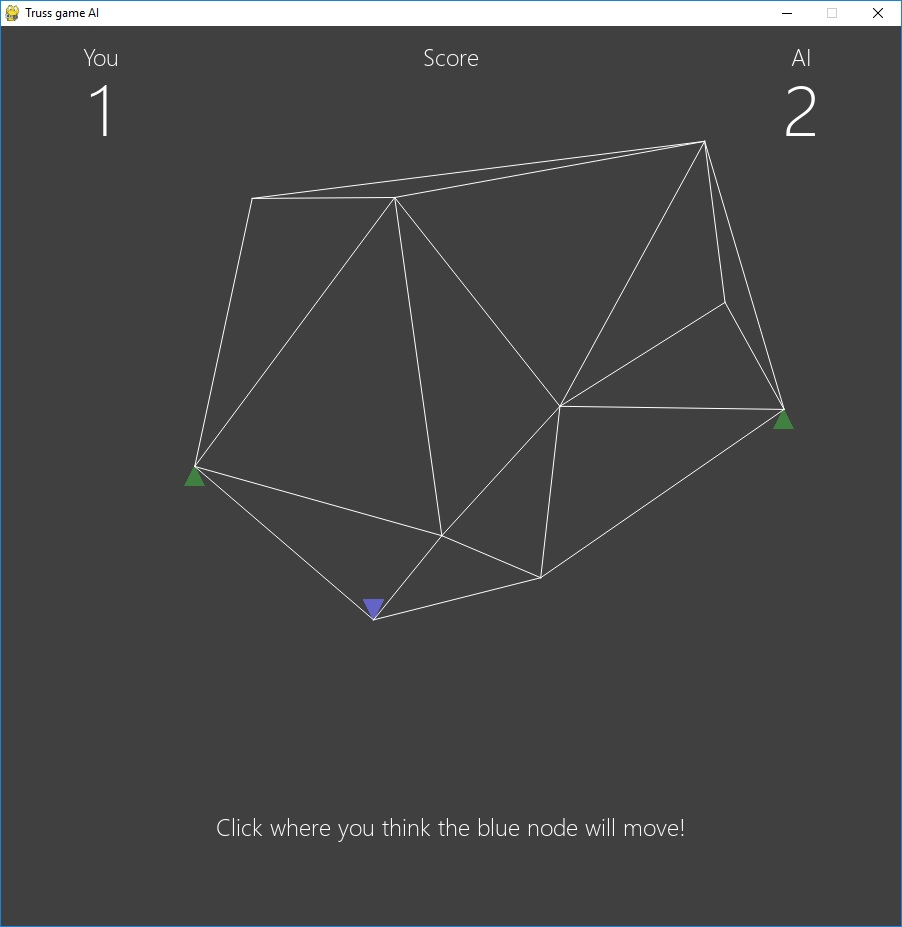

# Truss game

A random truss is loaded at one node. Guess where that node will end up once it
settles — an AI opponent guesses too, from a screenshot alone.

The AI never sees node coordinates or the topology, only the rendered image.
That constraint is the point of the project: it is what makes the comparison
against a human fair.

Read more about the idea in
['Is a fruit fly a smarter engineer than you?'](https://marton-krauter.medium.com/is-a-fruit-fly-a-smarter-engineer-than-you-850db1031fe8)

## Play

**[Play in your browser](https://mkrauter.github.io/TrussGame/v2/)** — no
download, no AI opponent, just you against the truss.

**[Download for Windows](https://github.com/mkrauter/TrussGame/releases/latest)**
— the version with the AI opponent. The binary is unsigned, so SmartScreen will
warn you; click *More info → Run anyway*.

## What is here

| path | what it is |
|---|---|
| `truss_game_original.py` | the original human-only game, kept as a historic reference |
| `truss_game_AI.py` | human against the AI opponent |
| `truss_game_AI_model.tflite` | the deployed model |
| `truss_game_AI_training.ipynb` | the Colab training notebook —  |
| `v2/` | browser rewrite of the human-only game, Canvas 2D, no dependencies |

## Running from source

    pip install -r requirements.txt
    python truss_game_AI.py

For `v2/`, serve the directory over HTTP — ES modules will not load from
`file://`:

    python -m http.server 8000

then open <http://127.0.0.1:8000/v2/>.

## How the physics works

Ten nodes are sampled in a 700×500 box with a minimum separation, and the
connectivity comes from a Delaunay triangulation. The two extreme-x nodes are
fully pinned. One random node is loaded vertically downward.

The solve is linear: the stiffness matrix is assembled from the undeformed
geometry and never updated, so `u = K⁻¹f` exactly. Displacements come out around
half the structure's length scale, which is why the deformation looks dramatic
for what is small-displacement theory. The animation ramps the load with a
decaying oscillation, but the target is always the settled state.

## How good is the AI, really

Measured on 150 freshly generated trusses it had never seen:

| predictor | mean | median |
|---|---|---|
| guess straight down by the average travel | **59.7%** | **66.5%** |
| the model | 55.6% | 59.4% |
| click on the node where it starts | 0.0% | 0.0% |

Scores are normalised by how far the node actually travelled, so the last row is
the metric's floor rather than a bad result — clicking the starting point scores
zero by definition.

So the model loses to a one-line heuristic. Decomposing it explains why: the model
locates the loaded node almost perfectly from pixels alone — 0.97 correlation
with the true position — but its displacement prediction scores a negative R²
against simply always guessing the mean. It learned to find the blue node and
drop it by roughly the average amount, which is most of the game's score and
none of the mechanics.

The number quoted in the training notebook was measured on training data. The
notebook also predates the deployed model and does not reproduce it.

## Notes for anyone hacking on this

`pygame` and `scipy` are pinned deliberately, and not for packaging reasons.
There are no plans to retrain the model, so whatever renders its input is part
of its contract — newer pygame ships a newer SDL that rasterises polygons
differently, which measurably moves the model's predictions. `requirements.txt`
explains each pin. Build tooling lives in `requirements-build.txt`.

Windows binaries are built by GitHub Actions on a clean runner whenever a `v*`
tag is pushed, and attached to the release automatically.
